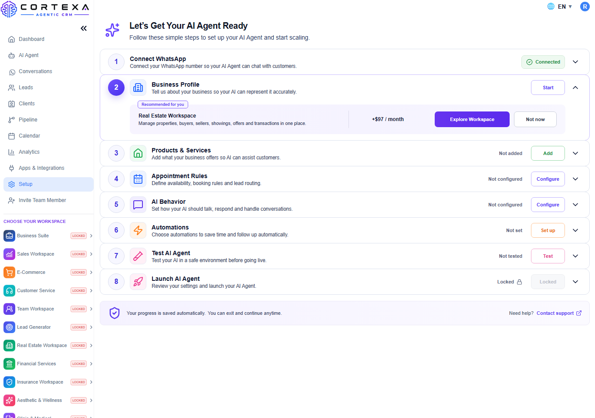
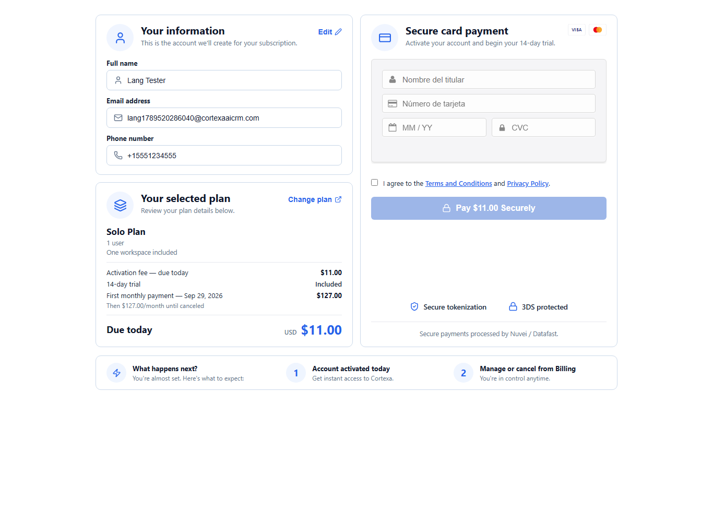
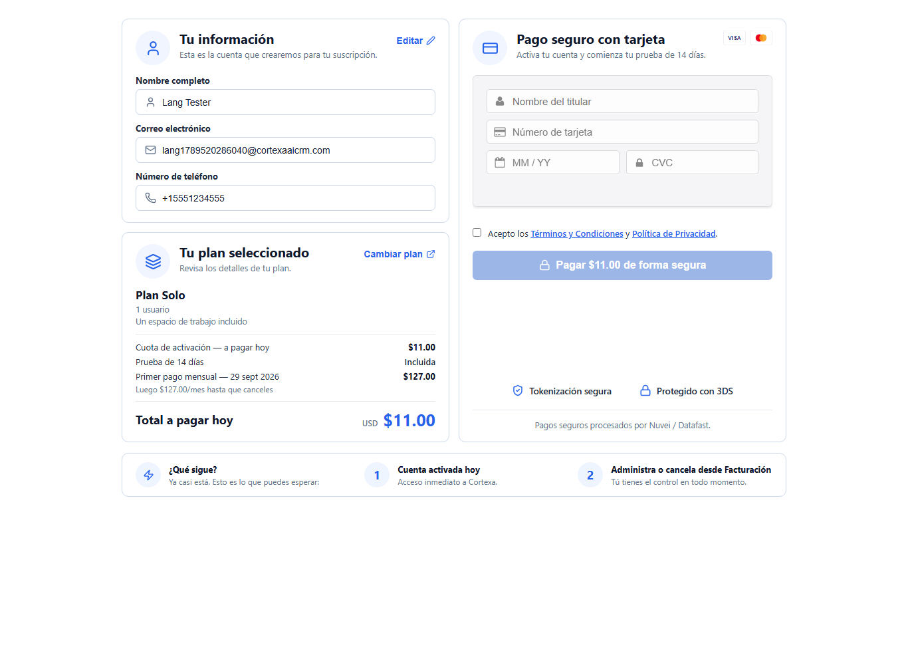
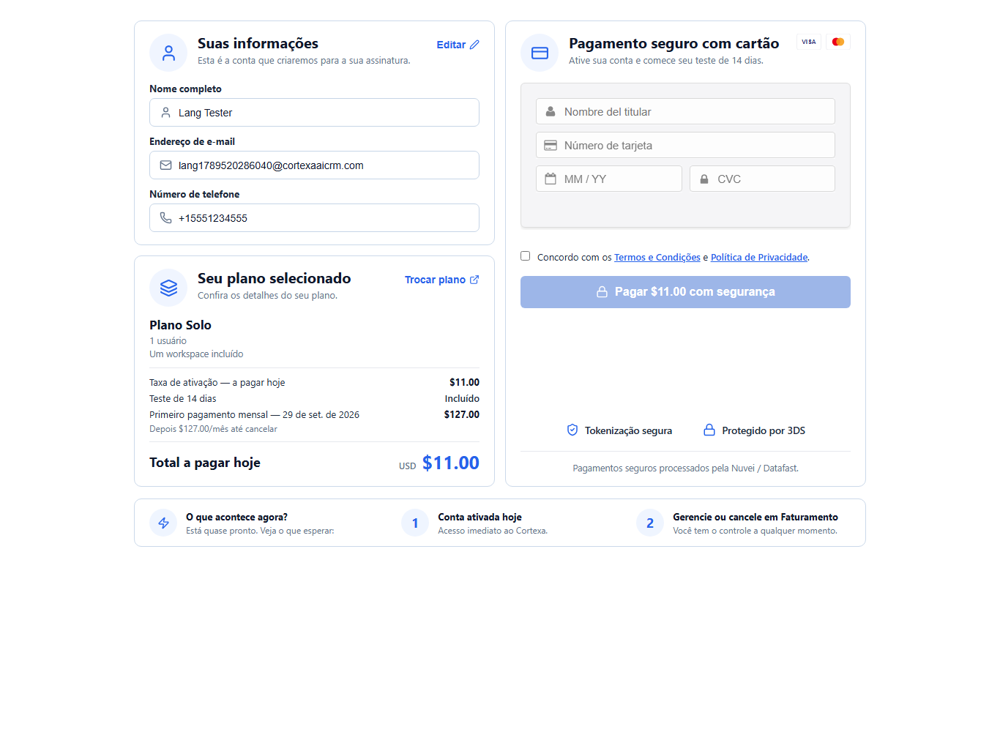
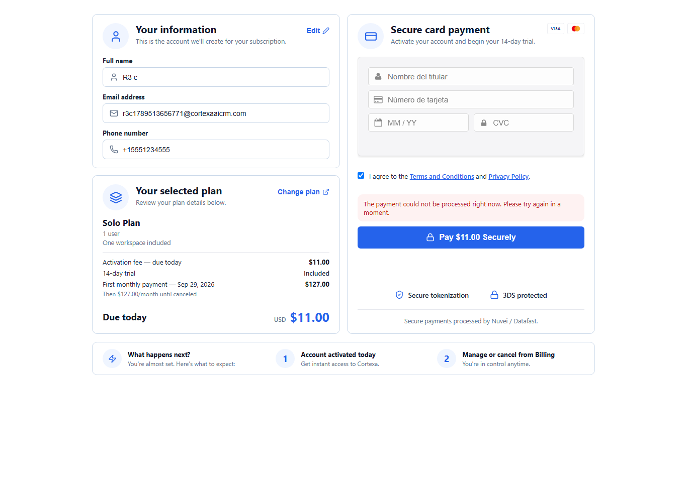
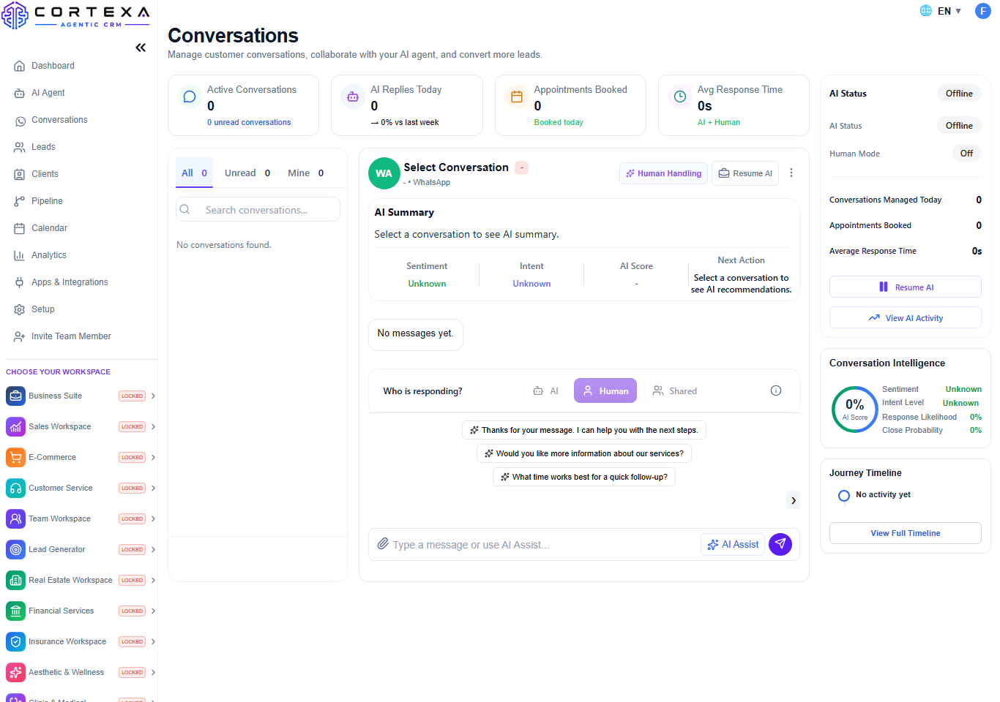
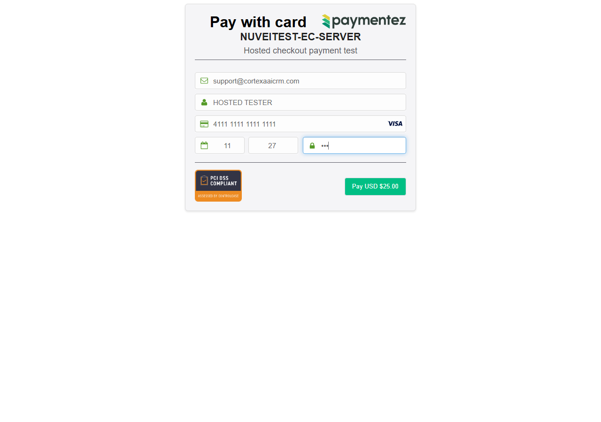
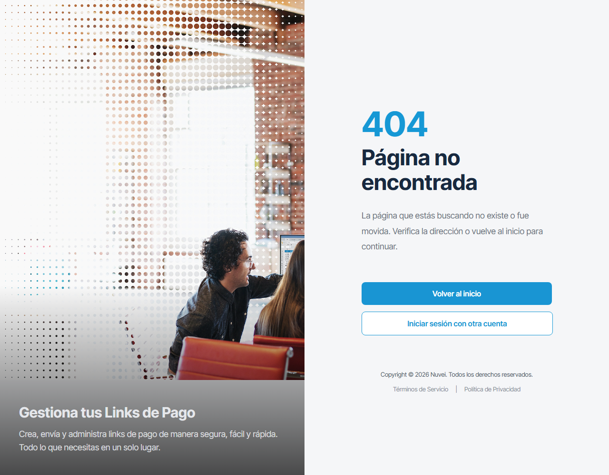
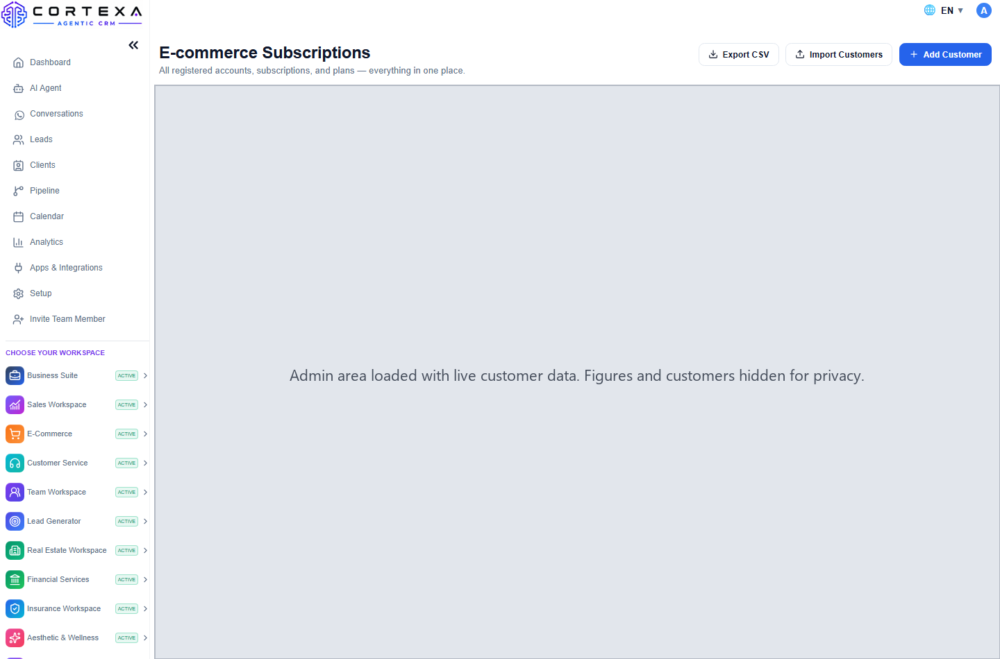
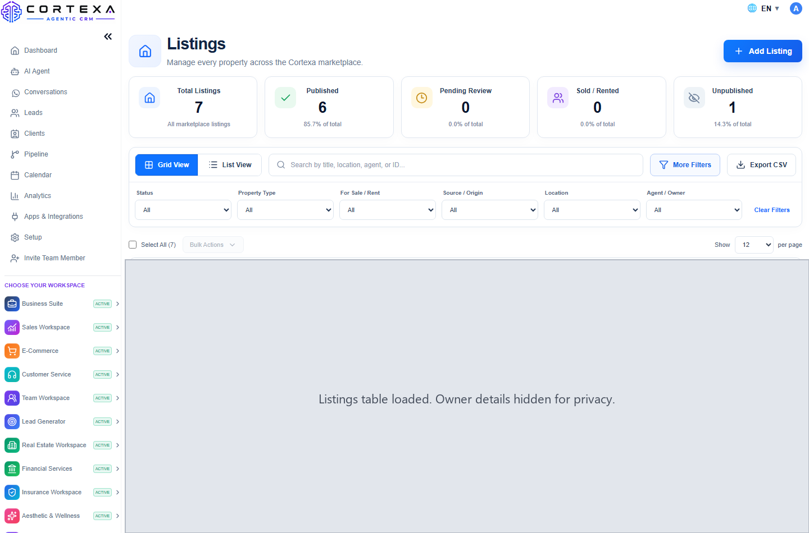

# Nuvei and Datafast integration, status and evidence

Last updated 18 September 2026.

Start here:

- [TEST_RESULTS.md](TEST_RESULTS.md) — every component, its state, what is still needed from Nuvei, and what is not yet tested with the reason.
- [ADMIN_ACCESS_VERIFICATION.md](ADMIN_ACCESS_VERIFICATION.md) — the admin access check on your administrator account, point by point, on the live site.

This repository is public, so no credentials, application codes, customer data or private email addresses appear in these pages or screenshots.

## Evidence

Subscription activated on the approved checkout:

Checkout in English, Spanish and Portuguese. The language comes from the address: /checkout, /es/checkout and /pt/checkout. The card fields come from Nuvei's tokenization form. We send that form the page language and Nuvei serves it marked with that language, but the card holder and card number labels are fixed in Spanish inside Nuvei's own script, so they read Spanish on all three:

A gateway refusal is shown as a processing problem, never as a card decline, and grants no access:

A refunded customer keeps their login on the free tier and can subscribe again:

A card payment entered and submitted on Nuvei's own hosted Checkout page. The application code and the payer email are hidden:

Link to Pay is working since 18 September. Until then the payment address Nuvei returned answered 404 for every order, which is the page below. Nuvei supplied a dedicated Link to Pay application, it was installed on the backend, and the links Cortexa hands out now open directly:

Complete Link to Pay payments were made on 17 and 18 September: Cortexa created the link, 23.00 USD was paid with a test card and Nuvei approved it, the payment was recorded and the payer received the confirmation email, a repeat was ignored, a wrongly signed notification was refused, and the refund was accepted. Nuvei sent no notification for either approved payment, which confirms the callback URL is not registered yet. The transaction and authorization codes were sent to you privately.

Admin area working for your administrator account, before and after signing out and back in. Customer data, revenue figures and listing details are hidden:

## What we need from Nuvei

1. Register the callback URL on both applications: `https://backend.cortexaaicrm.com/api/nuvei/callback`. Two approved payments produced no notification.
2. Enable 3D Secure on the staging application, or provide a 3DS enrolled card, plus a Diners card that asks for a one time password.
3. Fix the card form labels. Our checkout sends the page language, en, es or pt, and Nuvei's form page is served with that language, but Nuvei's form script, payment_2.14.9, has the card holder and card number labels fixed in Spanish, "Nombre del titular" and "Número de tarjeta". Only Nuvei can change that script.
4. Confirm that 3D Secure on Add Card is active for this account. Nuvei's own card form sends the 3D Secure browser data and runs any verification step inside the form, so there is nothing for the merchant to pass.
5. Production credentials for both the cards and the Link to Pay applications, and production approval, before any real card is charged.
